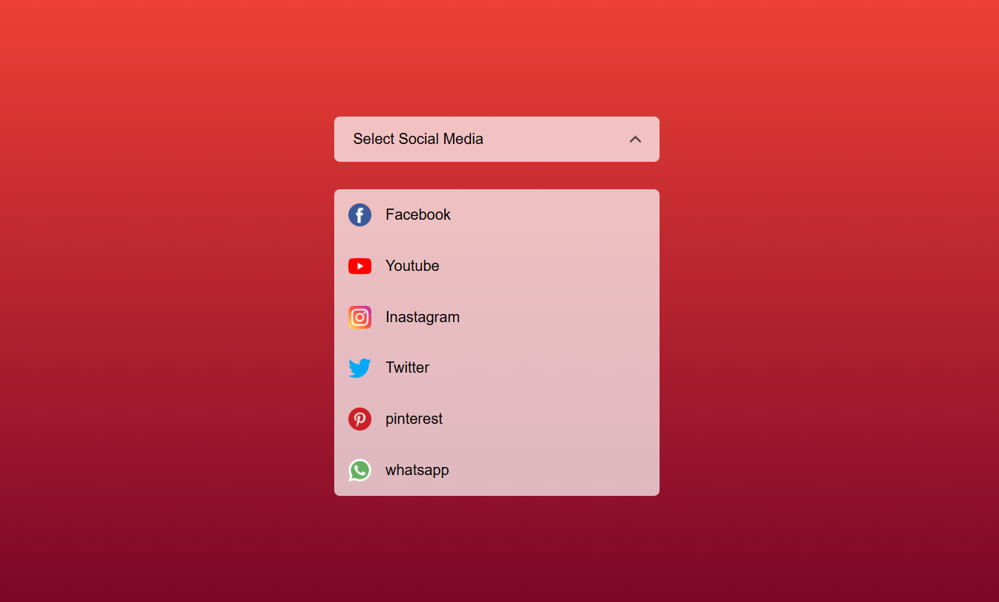

# 📱 Social Media Select Menu

A beautiful and responsive **Custom Social Media Select Menu** built using **HTML, CSS, and JavaScript**. Instead of the default HTML `<select>` element, this project creates a modern dropdown menu with icons, animations, and smooth user interaction.

---

## 🚀 Live Demo

🔗 **Live Website:** https://select-menu-alpha.vercel.app/


---

## 📸 Screenshot




---

## ✨ Features

- 🎨 Modern UI Design
- 📱 Responsive Layout
- 🔽 Custom Dropdown Menu
- 🖼️ Social Media Icons
- 🔄 Smooth Arrow Rotation Animation
- ⚡ Built with Pure JavaScript
- 💻 Beginner-Friendly Project

---

## 🛠️ Technologies Used

- HTML5
- CSS3
- JavaScript (ES6)

---

## 📂 Folder Structure

```text
Social-Media-Select-Menu/
│
├── images/
│   ├── facebook.png
│   ├── instagram.png
│   ├── youtube.png
│   ├── twitter.png
│   ├── pinterest.png
│   ├── whatsapp.png
│   ├── arrow.png
│   └── screenshot.png
│
├── index.html
├── style.css
├── script.js
└── README.md
```

---

## ⚙️ How It Works

1. Click the **Select Social Media** field.
2. The dropdown menu opens with a smooth animation.
3. Choose any social media platform.
4. The selected option replaces the default text.
5. The menu closes automatically after selection.

---

## 📸 Preview

| Default | Dropdown Open |
|---------|---------------|
| Select Social Media | List of Social Media Platforms |

---

## 🎯 Learning Objectives

This project helps beginners understand:

- DOM Manipulation
- Event Handling
- JavaScript Loops
- CSS Flexbox
- CSS Animations
- Custom Dropdown Creation
- UI Design Principles

---

## 🧠 Future Improvements

- Add keyboard navigation
- Search inside dropdown
- Dark Mode
- Mobile touch optimization
- Close dropdown when clicking outside
- Add more social media platforms

---

## 🏃‍♂️ Run Locally

Clone the project

```bash
git clone https://github.com/bs-bhaskar/select-menu.git
```

Go to the project folder

```bash
cd select-menu
```

Open `index.html` in your browser.

---

## 🤝 Contributing

Contributions are welcome!

If you'd like to improve this project:

1. Fork the repository
2. Create a new branch
3. Commit your changes
4. Push your branch
5. Open a Pull Request

---

## ⭐ Support

If you found this project helpful, don't forget to give it a **⭐ Star** on GitHub.

---

## 📄 License

This project is licensed under the MIT License.

---

Made with ❤️ by **Bhaskar Yogi**